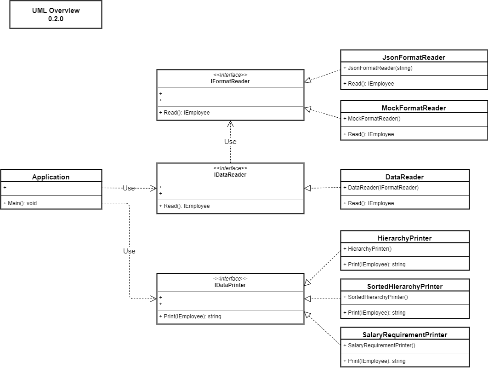

# Coding Challenge Read Me - C# Implementation

## How to Run / Execute

1. Windows 10 x64
    * Executable file at path: 
        * ~\CodingChallenge\ConsoleApp\bin\Release\netcoreapp2.2\win10-x64\ConsoleApp.exe

2. Linx x64
    * Executable file at path:
        * ~\CodingChallenge\ConsoleApp\bin\Release\netcoreapp2.2\linux-x64\ConsoleApp

## Example Program Input and Output

## Program Architecture

1. ConsoleApp
    * Description: This .NET assembly represents the User Interface.  It is also the program executable.

2. CodingChallengeLibrary
    * Description: This .NET assembly represents the Business Logic for the program.  It contains the interfaces and implementations that are consumed in the ConsoleApp

3. UnitTests
    * Description: This .NET assembly represents the Unit Tests for the functionality provided in the 'CodingChallengeLibrary' .NET assembly

## File Structure by .NET Assembly

1. ConsoleApp
    * Program.cs
        * The entry point to the console application
        * Composes the interfaces and implementations from the 'CodingChallengeLibrary' into an application

    * appsettings.json
        * Settings file where the Employee Hierarchy file name can be specified and the choice to sort the employee hierarchy output can be made

    * Hierarchy.json
        * Data file containing the JSON represenation of the given employee data

    * ConsoleApp.csproj
        * MSBuild file containing build information for the ConsoleApp .NET assembly

2. CodingChallengeLibrary
    * IEmployee.cs
        * The interface describing an Employee

    * Employee.cs
        * A concrete implementation of the IEmployee interface

    * Manager.cs
        * A concrete implementation of the IEmployee interface that facilitates the Decorator and Composite design patterns

    * DataPrinter
        * IDataPrinter.cs
            * The interface describing how to get data for printing to the console
        * HierarchyDataPrinter.cs
            * A concrete implementation of the 'IDataPrinter' interface responbile for formatting a string for the unsorted employee hierarchy
        * SortedHierarchyDataPrinter.cs
            * A concrete implementation of the 'IDataPrinter' interface responbile for formatting a string for the sorted employee hierarchy
        * SalaryRequirementPrinter.cs
            * A concrete implementation of the 'IDataPrinter' interface responbile for formatting a string for the total salary requirement

    * DataReader
        * IDataReader.cs
            * The interface describing how to read data from a data source and return a useful type for the application
        * DataReader.cs
            * A concrete implementation of the 'IDataReader' interface responsible for reading requesting data from an 'IFormatReader' object
    
    * FormatReader
        * IFormatReader.cs
            * The interface describing how to read data from a data source of a given format and return a useful type for the application
        * JsonFormatDataReader.cs
            * A concrete implementation of the 'IFormatReader' interface responsible for reading data from a JSON file and returning an 'IEmployee' representation of the data
        * MockFormatDataReader.cs
            * A concrete implementation of the 'IFormatReader' interface responsible for providing stub data for the given data in the Coding Challenge Problem Statement

3. UnitTests
    * TopLevelUnitTests.cs
        * Unit tests for testing top level elements of the 'CodingChallnegeLibrary' .NET assembly

    * DataPrinterUnitTests.cs
        * Units tests for testing the 'IDataPrinter' interface and implementations

    * DataReaderUnitTests.cs
        * Units tests for testing the 'IDataReader' interface and implementations

    * FormatReaderUnitTests.cs
        * Units tests for testing the 'IFormatReader' interface and implementations

## UML Diagram for Idea of How Types are Composed

